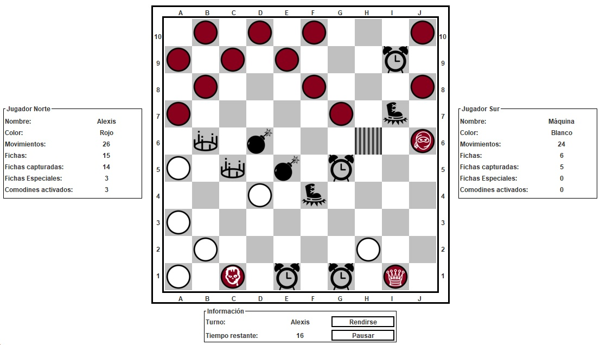
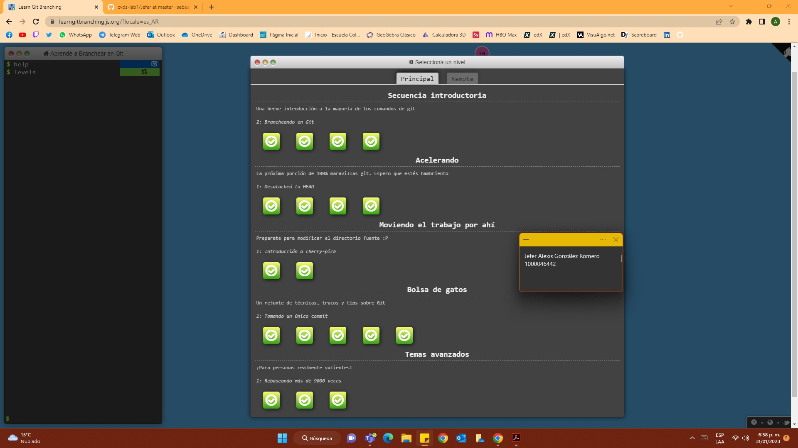
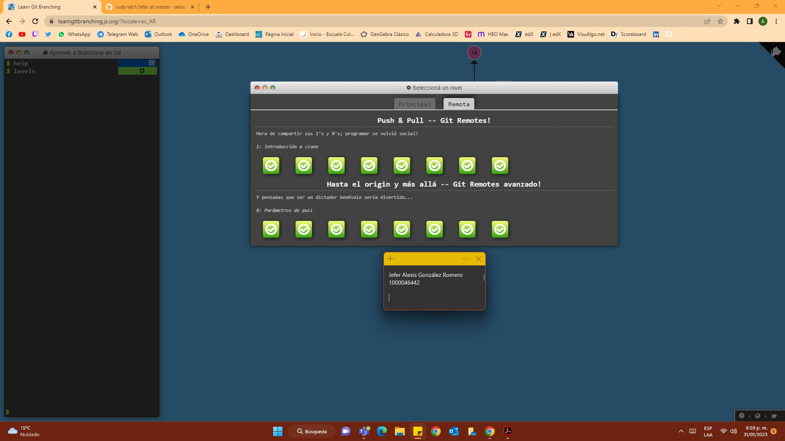

# Jefer Alexis González Romero

## Información general

Estudiante de ingeniería de sistemas.\
Estoy viendo actualmente 5 cursos:

1) CVDS
2) RECO
3) AUPN
4) FCFI
5) CLYS

**Otra información**

- **Semestre:** *Septimo*
- **Edad:** *20 años*
- [Linkedin](https://www.linkedin.com/in/AlexisGR7)

**Proyecto POOB**



Código de los movimientos posibles que puede hacer un peón:

```
	public ArrayList<int[]> movimientosPosibles() {
		ArrayList<int[]> m = new ArrayList<int[]>();
		if (casilla.salir()) {
			int fila = casilla.fila(), columna = casilla.columna(), a = 1;
			if (jugador.lado() == 's') a = -1;
			Tablero tablero = casilla.tablero();
			for (int dc=-1; dc<2;dc++) {
	            if (dc!=0 && tablero.dentro(fila+a, columna+dc) && tablero.ficha(fila+a, columna+dc) == null) {
	        		int[] p = {fila+a, columna+dc};
	        		m.add(p);
	            }
			}
			m.addAll(saltosPosibles());
		}
		return m;
	}
```
#PARTE III - GIT BRANCHING
##Sección "Main"

##Sección "Remote"

